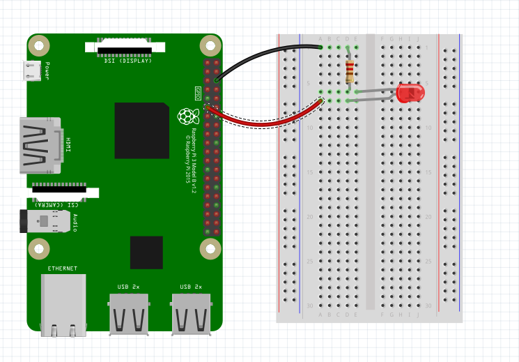

## What is this?
This python script will blink an LED programatically. The means you can control exactly how the LED blinks using software.

## Instructions:
1. Using a breadboard and jumper cables, connect GPIO pin 17 to a horizontal rail on the breadboard. We'll send power through this pin but for now, it's unpowered.
2. Connect the positive, longer lead of the LED to the horizontal rail with pin 17.
3. Connect the negative, shorter lead of the LED to one end of a resistor (it can be either end).
4. Connect the other end of the resistor to any unused horizontal rail on the breadboard.
5. Connect that rail to any ground pin on the Pi.
6. Run `python motion.py`. The script should run forever. To stop the script, type `ctrl + a` at the same time.

## Notes:
Right now the script blinks on and off each second. How might you speed this up or slow it down? How might you change its rhythm from regular, to irregular?

## Bonus:
Leave everything wired up when you do the motion project next. Then run `python motion_led.py` after wiring up the motion detector. See what it does!
