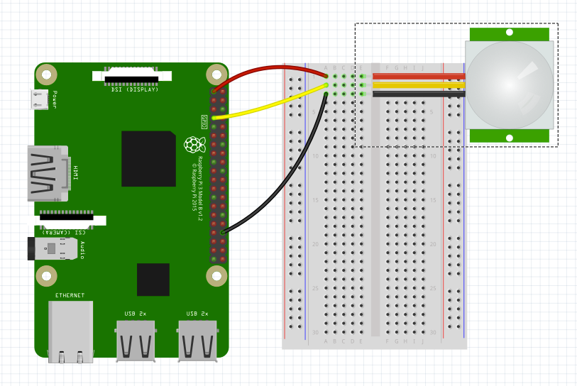

## What is this?
In this project we'll build a motion detector using a PIR, or a passive infrared sensor. It works by measuring the infrared light radiating from objects in its field of view. It's the same kind of sensor that might be in a motion-activated light.

## How to build it
The motion detector is a pretty simple build. It's almost plug-and-play! We'll use a breadboard here, but if you have the right jumper cables you can plug this directly into your Raspberry Pi.

1. Using female-to-female cables and a breadboard, connect the positive lead of the sensor (in my diagrams, it's the red cable) to the 5v output of the Raspberry Pi.
2. Connect the negative lead of the sensor (the black cable) to a ground pin on the Raspberry Pi.
3. Connect the data lead of the sensor (yellow cable) to GPIO pin 21.
4. Run `python motion.py` to start detecting motion. The program will print "MOTION DETECTED" when it detects motion. Otherwise it will print "...".
5. The script should run forever. To stop it, type `ctrl + c`

## Gotchas:
There are a lot of similar-looking PIR sensors out there. Yours might have the positive and negative leads switched. Try it both ways if you're not sure, it won't hurt the sensor.

## Notes:
The PIR sensor can be a little finicky. It detects motion in a wide range, so it may be triggered even if you are beside it or a little behind it. For best results try and point the sensor away from you toward the table. After waiting a few seconds to let any signal delays pass, wave your hand in front of it.

There are two dials on the front of the sensor that affect its sensitivity and its signal delay. You can turn them with a phillips screwdriver or a key. Try twisting them different directions and see the results!

A PIR sensor is a common beginner's sensor and there are lots of guides on the internet. A lot of them are frankly not very good and will give you incorrect information. I've found that the best resource is [Adafruit's PIR sensor guide](https://learn.adafruit.com/pir-passive-infrared-proximity-motion-sensor/connecting-to-a-pir).
