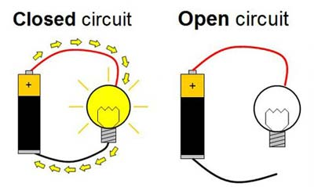
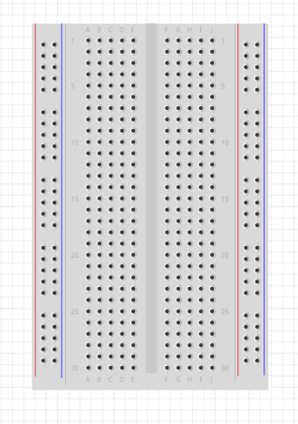
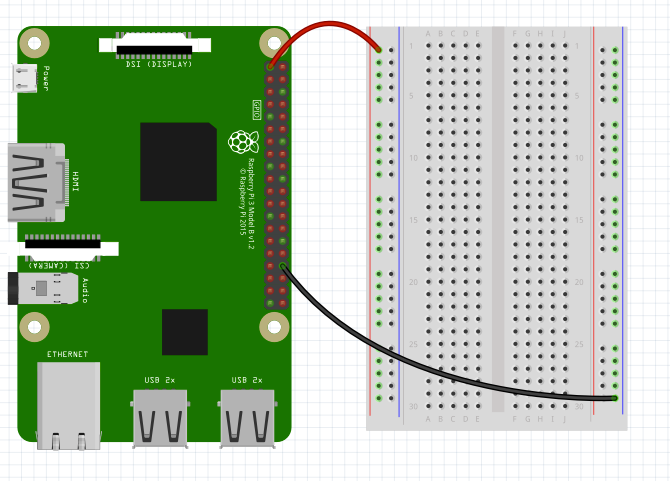
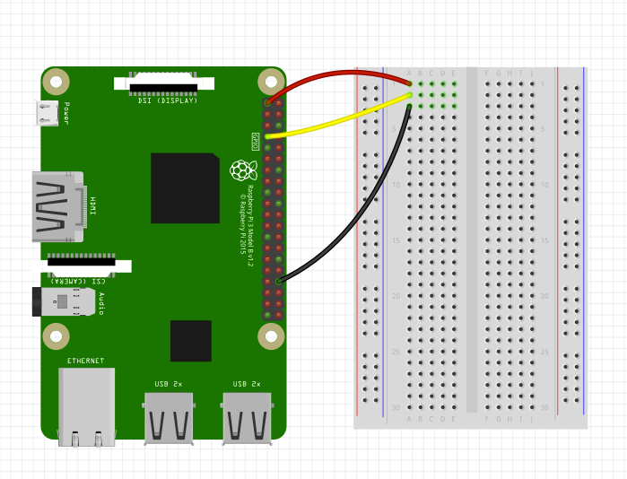

## Hands-on Projects

These are scripts for the various hands-on projects we will be building at News Hack AZ.

If you have the materials, you can do this at home! You need:

- A Raspberry Pi B or a Raspberry Pi Zero with header pins
- A breadboard
- An LED
- A resistor
- A DHT_22 temperature/humidity sensor
- A PIR motion detector

In this lesson, we are going to build three separate circuits. We'll learn about how the Pi can control circuits with software and how it can read data as well.

The recommended order is to first do the project in the `led` folder, then the `motion` folder, and finally the `temp_humidity` folder.

## A quick note on circuits
As you probably learned in school, a "circuit" is when you connect positive voltage to "ground", or 0 volts. In the case of a battery, that might look like this:

For these projects, we'll use "jumper cables" and a "breadboard". A breadboard lets you easily connect wires without soldering. You'll stick the pointy end of a jumper cable into a hole in the breadboard. Metal strips underneath the board will connect that cable to other spots in the board.

When you plug cables into the breadboard, you can create closed circuits just like with a battery. Typically you'll connect power to the vertical red lines on the side and the "ground" to the vertical blue lines. That way, if you connect any jumper cables to ANY of those holes on the sides, you'll connect to either power or ground. The connected holes are highlighted in green below. The red wire is carrying power from the Pi and the black wire is connected to ground.

The rules are different for the horizontal rows. When you connect something to the horizontal rows, you create a connection along those horizontal rows, but not vertically. Depending on what else is connected to those wires, the row may be connected to ground, to power, or to something else. The connected holes are lit up in green below:

