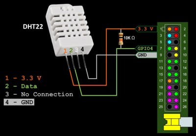
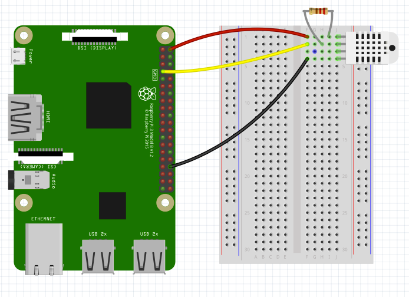

## What is this?

In this project we'll hook up a temperature and humidity sensor. It's a cool sensor because it's really TWO sensors in one. We'll have to use some different coding techniques here because the manufacturer has provided us with a special Python library for interfacing with the sensor. A lot of manufacturers will do this for certain kinds of sensors, and it's usually a good thing. When buying sensors, look for ones with good documentation and code examples online.

## Instructions:
1. Using a breadboard and jumper cables, first connect the the 3.3v connector on the Raspberry Pi to one end of a 10k ohm resistor.
2. Using a jumper cable, connect that same end of the resistor to the positive lead of the sensor (the first pin on the left if you are looking at the grating). The other end of the resistor should still be unconnected to anything.
3. Connect the negative end of the sensor (the fourth pin from the left)  to the Raspberry Pi ground pin.
4. Connect the data pin on the sensor (second pin from the left) to the other end of the resistor.
5. Finally connect that end of the resistor to a GPIO input pin (GPIO 4)
6. To get data, run `python temp.py`
7. The script will run forever if uninterrupted. To interrupt the script, type `ctrl + a`

## Log the data
Getting data on the command line is cool, but storing it for later is cooler.

Try these scripts out:

`log_data_10.py` logs data into a csv, called `data.csv` every 10 seconds.

`log_data_60.py` logs data each minute into a csv, called `test_data.csv`.
